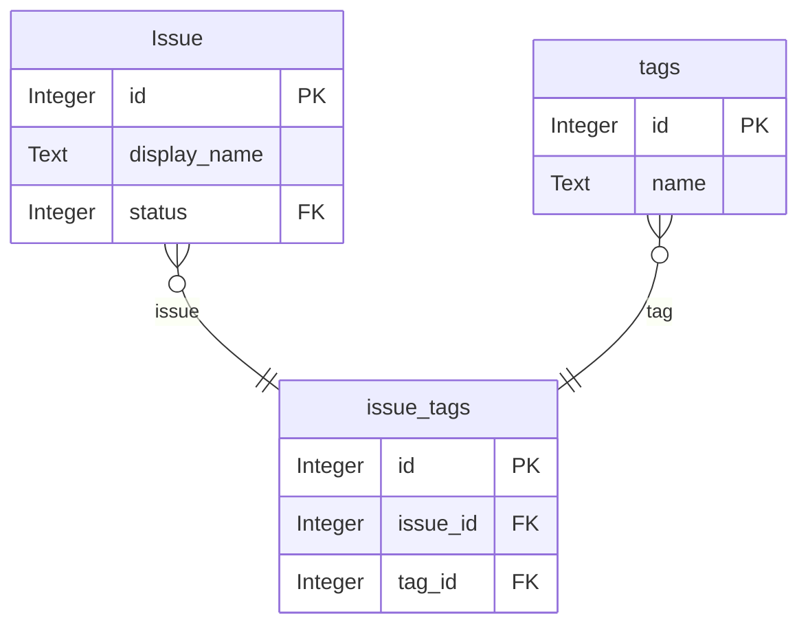
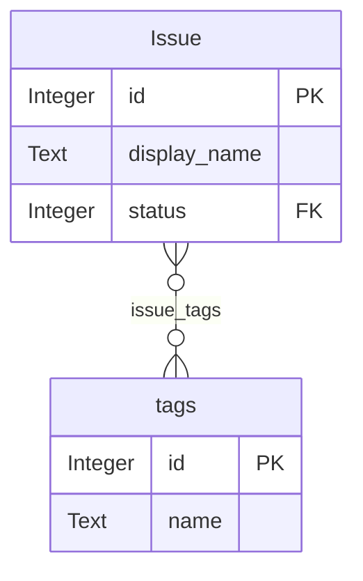

# Many-to-Many Relationships Feature Design

**Status:** ✅ Implemented (v1.0 Complete)
**Created:** 2025-10-10
**Updated:** 2025-10-11
**Author:** System Design Document

**Version:** 1.0 - FINAL IMPLEMENTATION

**Implementation Note**: The final implementation differs from the original design in several key aspects:
- M:M editing is on **Detail pages only** (not Create/Edit) using `ManyToManyEditorComponent`
- Junction tables use **composite primary keys** (NOT surrogate IDs) to prevent duplicate key errors
- **Immediate save pattern** (like Gmail labels) with display/edit mode toggle
- **Direct REST operations** (POST/DELETE) instead of RPC/stored procedures
- Permission checking via `AuthService.hasPermission()` RPC function

## Final Implementation Summary

### What Was Actually Built (v1.0)

**Location**: M:M relationships are edited on **Detail pages only**, not Create/Edit pages.

**UI Pattern**:
- **Display Mode** (default): Read-only colored badges with "Edit" button
- **Edit Mode**: Checkboxes with search, pending changes preview, and Save/Cancel buttons

**Database Schema**:
```sql
-- Junction tables MUST use composite primary keys (no surrogate id)
CREATE TABLE issue_tags (
  issue_id BIGINT NOT NULL REFERENCES "Issue"(id) ON DELETE CASCADE,
  tag_id INT NOT NULL REFERENCES tags(id) ON DELETE CASCADE,
  created_at TIMESTAMPTZ NOT NULL DEFAULT NOW(),
  PRIMARY KEY (issue_id, tag_id)  -- Composite key prevents duplicates
);

-- REQUIRED: Index both foreign keys for performance
CREATE INDEX idx_issue_tags_issue_id ON issue_tags(issue_id);
CREATE INDEX idx_issue_tags_tag_id ON issue_tags(tag_id);
```

**Data Flow**:
1. SchemaService detects junction tables using heuristics (exactly 2 FKs, no extra columns)
2. DetailPage renders `ManyToManyEditorComponent` for each M:M property
3. Component checks permissions using `AuthService.hasPermission()` (requires CREATE + DELETE on junction table)
4. User clicks "Edit" → enters edit mode with checkboxes
5. Component shows pending changes preview ("+N to add, -N to remove")
6. User clicks "Save" → component executes parallel POST/DELETE operations via `DataService`
7. On success, component emits `relationChanged` event → DetailPage refreshes data

**Key Components**:
- `ManyToManyEditorComponent`: Standalone component for M:M editing on Detail pages
- `DataService.addManyToManyRelation()`: POST to junction table
- `DataService.removeManyToManyRelation()`: DELETE from junction table with composite key filter
- `AuthService.hasPermission()`: Checks user's table-level permissions via RPC

**Why This Pattern**:
- **Prevents accidental deletions**: Display mode by default, explicit edit action required
- **Immediate feedback**: Pending changes preview shows what will happen before saving
- **Simpler implementation**: No complex form state management on Create/Edit pages
- **Better UX**: Users can see the entity first, then add relationships
- **No surrogate ID issues**: Composite keys eliminate duplicate key errors

## Table of Contents
1. [Final Implementation Summary](#final-implementation-summary) ✅ NEW
2. [Overview](#overview)
3. [Architectural Decisions](#architectural-decisions)
3. [Reference Implementation](#reference-implementation)
4. [Detection Strategy](#detection-strategy)
5. [Technical Architecture](#technical-architecture)
6. [Multi-Select Component](#multi-select-component)
7. [Schema Layer Changes](#schema-layer-changes)
8. [Display Layer Changes](#display-layer-changes)
9. [Edit Layer Changes](#edit-layer-changes)
10. [Data Service Changes](#data-service-changes)
11. [ERD Visualization Updates](#erd-visualization-updates)
12. [Key Distinctions](#key-distinctions)
13. [Implementation Phases](#implementation-phases)
14. [Edge Cases & Decisions](#edge-cases--decisions)
15. [Testing Strategy](#testing-strategy)
16. [Angular 20 Best Practices](#angular-20-best-practices)
17. [Future Enhancements](#future-enhancements)

---

## Overview

### Problem Statement

Currently, Civic OS treats junction tables (pivot tables) as separate entities in the UI. When two entities have a many-to-many relationship through a junction table, users must:

1. Navigate to the junction table entity to see/edit relationships
2. Manually create junction records to establish relationships
3. View junction tables in the ERD diagram (cluttering the visualization)

**Example**: A `user_roles` junction table appears as a separate entity in the menu, list pages, and ERD, when conceptually it should just be a property of both `users` and `roles`.

### Solution

Implement automatic many-to-many (M:M) relationship detection and UI generation that:

1. **Auto-detects** simple junction tables using structural heuristics
2. **Collapses** detected junctions into M:M properties on both related entities
3. **Displays** M:M as inline badges/chips on Detail pages
4. **Edits** M:M via multi-select checkboxes on Create/Edit forms
5. **Hides** junction tables from ERD, showing direct M:M relationships instead
6. **Uses unified embedding** - single query fetches entity + all relationships

### Benefits

- **Intuitive UX**: Users work with natural relationships, not junction tables
- **Cleaner ERD**: Diagrams show conceptual relationships, not implementation details
- **Faster workflows**: Edit relationships inline instead of navigating to junction tables
- **Database-agnostic**: Works with existing databases, no forced naming conventions
- **Backward compatible**: Complex junctions remain normal entities
- **Performance**: Single-query data fetching with PostgREST embedded resources

---

## Architectural Decisions

### Decision 1: Junction Tables vs. Array Columns

**Considered Approach:** Use PostgreSQL array columns (e.g., `Issue.tag_ids int[]`) instead of junction tables.

**Decision:** Use junction tables (traditional approach)

**Rationale:**

| Aspect | Array Columns | Junction Tables |
|--------|---------------|-----------------|
| **Foreign key constraints** | ❌ Not supported in PostgreSQL | ✅ Full FK support with CASCADE |
| **Referential integrity** | ⚠️ Application-level only | ✅ Database-enforced |
| **Bidirectional queries** | ⚠️ Expensive reverse lookups | ✅ Indexed, fast both directions |
| **Auto-detection** | ❌ No schema info (just int[]) | ✅ Clear FK metadata |
| **Portability** | ❌ PostgreSQL-specific | ✅ Standard SQL (all databases) |
| **Relationship metadata** | ❌ No place for audit trails | ✅ Can add created_at, created_by |

**Key Issue with Arrays:** PostgreSQL does NOT support foreign key constraints on array elements. This means:
- No CASCADE deletes (orphaned IDs when tags deleted)
- No validation (can insert non-existent tag IDs)
- No referential integrity guarantees

**Research Summary:** According to PostgreSQL documentation and Stack Overflow consensus, array foreign keys were proposed for the SQL:2016 standard but never implemented in PostgreSQL due to performance and reliability concerns. The recommended approach remains traditional junction tables with proper foreign key constraints.

### Decision 2: Unified Embedding Approach

**Decision:** Use single query with PostgREST embedded resources for all property types (regular, FK, M:M)

**Instead of separate queries:**
```http
# ❌ Inefficient: Multiple queries
GET /Issue?id=eq.123
GET /issue_tags?issue_id=eq.123&select=tag:tags(*)
```

**Use embedded resources:**
```http
# ✅ Efficient: Single query
GET /Issue?id=eq.123&select=*,status:statuses(*),issue_tags(tag:tags(*))
```

**Benefits:**
- Single HTTP request (avoids N+1 query problem)
- Consistent with existing FK handling
- PostgREST optimizes the joins
- Faster page loads
- Cleaner service layer code

### Decision 3: Heuristic Detection Only (v1.0)

**Decision:** Initial implementation uses heuristic detection only. Metadata override system deferred to v2.0.

**Rationale:**
- Heuristic covers 90% of use cases
- Reduces initial complexity
- Can be added later without breaking changes
- Users can work around edge cases by restructuring tables

**Deferred to v2.0:**
- `metadata.many_to_many_relationships` table
- Admin UI for M:M configuration
- Manual override of detection
- Bidirectionality control flags
- Custom display names

### Decision 4: Angular 20 Best Practices

**Decision:** Use Angular 20 signal-based APIs throughout

**Patterns:**
- `input()` instead of `@Input()` decorators
- `signal()` for component state
- `computed()` for derived state
- `@if/@for` control flow (not `*ngIf/*ngFor`)
- `OnPush` change detection with signals
- `toSignal()` for Observable → Signal conversion
- Standalone components (no NgModule)

---

### Distinction from Related Records (Inverse Relationships)

Many-to-many relationships are fundamentally different from the existing "Related Records" feature:

| Aspect | Many-to-Many | Related Records |
|--------|--------------|-----------------|
| **Nature** | Bidirectional equal relationship | Unidirectional foreign key reference |
| **Location** | Inline in properties grid | Separate section below properties |
| **Editability** | Editable on Create/Edit pages | Read-only preview on Detail |
| **Display** | Compact badges/chips | Expanded cards with counts |
| **Implementation** | Junction table with 2 FKs | Single FK column |
| **Example** | User has many Roles | IssueStatus has many Issues referencing it |

**Visual Example - User Detail Page**:
```
╔═══════════════════════════════════════════════════════╗
║ User: John Doe                              [Edit]    ║
╠═══════════════════════════════════════════════════════╣
║ Properties (main entity data):                        ║
║   Display Name: John Doe                              ║
║   Email: john@example.com                             ║
║   Roles: [Admin] [Editor] [Viewer]  ← M:M (editable) ║
║   Created: 2024-01-15                                 ║
╠═══════════════════════════════════════════════════════╣
║ Related Records (inverse relationships):              ║
║ ┌─────────────────────────────────────────────┐      ║
║ │ Issues Created (12)                          │      ║
║ │ • Pothole on Main St                         │      ║
║ │ • Broken light on Oak Ave                    │      ║
║ │ [View all 12 Issues]                         │      ║
║ └─────────────────────────────────────────────┘      ║
║ ┌─────────────────────────────────────────────┐      ║
║ │ Bids Submitted (5)                           │      ║
║ │ • Bid for Work Package #3                    │      ║
║ │ [View all 5 Bids]                            │      ║
║ └─────────────────────────────────────────────┘      ║
╚═══════════════════════════════════════════════════════╝
```

---

## Reference Implementation

To test and demonstrate the M:M feature, we'll add a tagging system to the pot-hole application.

### Database Schema

```sql
-- Tags entity
CREATE TABLE "public"."tags" (
  "id" SERIAL PRIMARY KEY,
  "name" VARCHAR(50) NOT NULL UNIQUE,
  "color" VARCHAR(7) DEFAULT '#3B82F6',  -- Hex color for badge display
  "description" TEXT,
  "created_at" TIMESTAMPTZ NOT NULL DEFAULT NOW(),
  "display_name" TEXT GENERATED ALWAYS AS (name) STORED
);

-- Junction table (will be auto-detected as M:M)
-- IMPORTANT: Uses composite primary key (NOT surrogate id)
CREATE TABLE "public"."issue_tags" (
  "issue_id" BIGINT NOT NULL,
  "tag_id" INT NOT NULL,
  "created_at" TIMESTAMPTZ NOT NULL DEFAULT NOW(),
  CONSTRAINT "issue_tags_issue_fkey"
    FOREIGN KEY ("issue_id") REFERENCES "Issue"("id") ON DELETE CASCADE,
  CONSTRAINT "issue_tags_tag_fkey"
    FOREIGN KEY ("tag_id") REFERENCES "tags"("id") ON DELETE CASCADE,
  PRIMARY KEY ("issue_id", "tag_id")  -- Composite key prevents duplicate relationships
);

-- Indexes for performance (critical for junction queries)
CREATE INDEX "idx_issue_tags_issue_id" ON "public"."issue_tags"("issue_id");
CREATE INDEX "idx_issue_tags_tag_id" ON "public"."issue_tags"("tag_id");

-- Permissions
GRANT SELECT, INSERT, DELETE ON TABLE "public"."tags" TO authenticated;
GRANT SELECT, INSERT, DELETE ON TABLE "public"."issue_tags" TO authenticated;
GRANT USAGE ON SEQUENCE "public"."tags_id_seq" TO authenticated;
-- Note: issue_tags has no sequence since it uses composite primary key

-- Sample data
INSERT INTO "public"."tags" ("name", "color", "description") VALUES
  ('Urgent', '#EF4444', 'Requires immediate attention'),
  ('Intersection', '#F59E0B', 'Located at an intersection'),
  ('School Zone', '#EAB308', 'Near a school'),
  ('Sidewalk', '#3B82F6', 'Sidewalk-related issue'),
  ('Road Surface', '#6366F1', 'Road surface damage'),
  ('Drainage', '#06B6D4', 'Water drainage problem'),
  ('Lighting', '#8B5CF6', 'Street lighting issue'),
  ('Signage', '#EC4899', 'Traffic sign or street sign');
```

### Why Tags?

**Perfect for Testing**:
- ✅ Pure junction table (only 2 FKs + metadata) → triggers heuristic detection
- ✅ Bidirectional use case (Issue→Tags and Tag→Issues both make sense)
- ✅ Visual appeal (colored badges look great in UI)
- ✅ Intuitive concept (everyone understands tagging)
- ✅ Low risk (tags are optional, won't break core workflows)

**Real-World Value**:
- Filter issues by multiple tags
- Quick visual categorization
- Cross-cutting organization (different dimension than status/work package)

**Demo Story (Updated for Final Implementation)**:
> "Users can tag issues with categories like 'Urgent', 'School Zone', or 'Drainage'.
> The system automatically detects the junction table. When viewing an issue detail page,
> tags are displayed as colored badges. Clicking 'Edit' reveals a checkbox interface with
> a pending changes preview showing what will be added or removed. Clicking 'Save' immediately
> updates the relationships using direct REST operations, and the display refreshes to show
> the new tags."

### Expected UI Behavior (Final Implementation)

**Issue Create/Edit Form**:
```
┌─────────────────────────────────────┐
│ Title: Pothole on Main Street       │
│ Status: [New ▼]                      │
│ Location: [Map]                      │
│                            [Save]    │
└─────────────────────────────────────┘
```
*Note: Tags cannot be added during creation. User must create the issue first, then add tags on the detail page.*

**Issue Detail Page (Display Mode)**:
```
╔════════════════════════════════════════════════════╗
║ Issue: Pothole on Main Street          [Edit]     ║
╠════════════════════════════════════════════════════╣
║ Status: New                                        ║
║ Location: Map showing location                     ║
║ Created: 2024-01-15                                ║
╠════════════════════════════════════════════════════╣
║ Tags                                               ║
║ [Urgent] [Intersection] [Road Surface]             ║
║                                                    ║
║ [Edit Tags]  ← Click to enter edit mode           ║
╚════════════════════════════════════════════════════╝
```

**Issue Detail Page (Edit Mode)**:
```
╔════════════════════════════════════════════════════╗
║ Issue: Pothole on Main Street          [Edit]     ║
╠════════════════════════════════════════════════════╣
║ Status: New                                        ║
║ Location: Map showing location                     ║
║ Created: 2024-01-15                                ║
╠════════════════════════════════════════════════════╣
║ Tags                                               ║
║                                                    ║
║ ℹ️ Pending changes: +1 to add, -1 to remove        ║
║                                                    ║
║ [Search tags...]                                   ║
║ ☑ Urgent                                           ║
║ ☑ Intersection                                     ║
║ ☐ School Zone                                      ║
║ ☐ Sidewalk                                         ║
║ ☑ Road Surface                                     ║
║ ☑ Drainage  ← Just checked (will be added)        ║
║ ☐ Lighting                                         ║
║ ☐ Signage                                          ║
║                                                    ║
║ 4 selected                                         ║
║                                                    ║
║ [Save Changes]  [Cancel]                           ║
╚════════════════════════════════════════════════════╝
```

**Tag Detail Page**:
```
╔════════════════════════════════════════╗
║ Tag: Urgent                             ║
╠════════════════════════════════════════╣
║ Color: #EF4444 [■]                     ║
║ Description: Requires immediate...     ║
║ Issues: [Pothole on Main St]           ║
║         [Broken light Oak Ave]         ║
║         [+15 more]                     ║
╚════════════════════════════════════════╝
```

---

## Detection Strategy

### Heuristic Auto-Detection

The system automatically identifies junction tables using **structural analysis**, not naming conventions. This fits Civic OS's database-agnostic philosophy.

#### Detection Algorithm

```typescript
/**
 * Detect if a table is a simple junction table (many-to-many pivot).
 *
 * Criteria:
 * 1. Must have exactly 2 foreign key columns
 * 2. Both FKs must reference tables in 'public' schema
 * 3. All other columns must be metadata (id, created_at, updated_at, timestamps)
 * 4. No additional data columns
 *
 * @returns true if table matches junction table heuristic
 */
function isJunctionTable(
  tableName: string,
  allProperties: SchemaEntityProperty[]
): boolean {
  const tableProps = allProperties.filter(p => p.table_name === tableName);

  // Find all foreign key columns
  const fkProps = tableProps.filter(p =>
    p.join_table &&
    p.join_schema === 'public' &&
    p.type === EntityPropertyType.ForeignKeyName
  );

  // Must have exactly 2 foreign keys
  if (fkProps.length !== 2) {
    return false;
  }

  // Check that all other columns are metadata
  const metadataColumns = ['id', 'created_at', 'updated_at'];
  const nonMetadataProps = tableProps.filter(p =>
    !metadataColumns.includes(p.column_name) &&
    !fkProps.includes(p)
  );

  // If there are any non-metadata, non-FK columns, it's NOT a simple junction
  return nonMetadataProps.length === 0;
}
```

#### Examples

**✅ Detected as Junction**:
```sql
-- Simple junction: only 2 FKs + metadata
CREATE TABLE user_roles (
  id SERIAL PRIMARY KEY,
  user_id UUID REFERENCES users(id),
  role_id INT REFERENCES roles(id),
  created_at TIMESTAMPTZ DEFAULT NOW()
);
```

**❌ NOT Detected as Junction** (has additional data):
```sql
-- Complex junction: has extra columns
CREATE TABLE user_roles (
  id SERIAL PRIMARY KEY,
  user_id UUID REFERENCES users(id),
  role_id INT REFERENCES roles(id),
  granted_by UUID REFERENCES users(id),  -- Additional FK!
  granted_at TIMESTAMPTZ,                -- Additional data!
  expires_at TIMESTAMPTZ,                -- Additional data!
  created_at TIMESTAMPTZ DEFAULT NOW()
);
```

**❌ NOT Detected as Junction** (only 1 FK):
```sql
-- Regular entity: only 1 FK
CREATE TABLE issues (
  id SERIAL PRIMARY KEY,
  status_id INT REFERENCES issue_statuses(id),  -- Only 1 FK
  title TEXT,
  created_at TIMESTAMPTZ DEFAULT NOW()
);
```

**❌ NOT Detected as Junction** (3 FKs):
```sql
-- Three-way junction: 3 FKs (requires different handling)
CREATE TABLE project_user_roles (
  id SERIAL PRIMARY KEY,
  project_id INT REFERENCES projects(id),
  user_id UUID REFERENCES users(id),
  role_id INT REFERENCES roles(id)
);
```

### Metadata Override (Deferred to v2.0)

**Note:** The metadata override system is deferred to v2.0. Initial implementation (v1.0) uses heuristic detection only.

For edge cases where the heuristic doesn't correctly identify junction tables, or where custom behavior is needed, future versions will support a metadata table for explicit configuration. See "Future Enhancements" section for details.

**Workaround for v1.0:** If a junction table needs different behavior, restructure it to either match the heuristic (remove extra columns) or remain as a normal entity.

---

## Technical Architecture

### Data Flow

```
┌─────────────────────────────────────────────────────────────────┐
│ 1. DETECTION PHASE (SchemaService initialization)              │
├─────────────────────────────────────────────────────────────────┤
│ schema_properties (PostgreSQL) → SchemaService                  │
│   ↓                                                             │
│ detectJunctionTables() → Heuristic analysis                     │
│   ↓                                                             │
│ ManyToManyMeta[] (cached in service)                            │
│   ↓                                                             │
│ Virtual M:M properties added to both related entities           │
└─────────────────────────────────────────────────────────────────┘

┌─────────────────────────────────────────────────────────────────┐
│ 2. UNIFIED DATA FETCHING (Detail, Edit, List pages)            │
├─────────────────────────────────────────────────────────────────┤
│ Component calls: dataService.getData(tableName, propertyList)   │
│   ↓                                                             │
│ DataService.buildSelectString() detects property types          │
│   - Regular columns: "id,display_name"                          │
│   - Foreign Keys: "status:statuses(id,display_name)"           │
│   - Many-to-Many: "issue_tags(tag:tags(id,display_name,color))"│
│   ↓                                                             │
│ PostgREST: /Issue?id=eq.123&select=<unified_select_string>     │
│   (SINGLE query with embedded FK and M:M)                       │
│   ↓                                                             │
│ DataService.transformResponse() flattens nested structures      │
│   - FK: status → status object                                  │
│   - M:M: issue_tags[{tag:{...}}] → issue_tags_m2m[{...}]      │
│   ↓                                                             │
│ DisplayPropertyComponent renders badges                         │
└─────────────────────────────────────────────────────────────────┘

┌─────────────────────────────────────────────────────────────────┐
│ 3. EDIT PHASE (Create/Edit forms)                              │
├─────────────────────────────────────────────────────────────────┤
│ EditPropertyComponent detects EntityPropertyType.ManyToMany     │
│   ↓                                                             │
│ MultiSelectComponent loads options (all tags)                   │
│   ↓                                                             │
│ User toggles checkboxes (FormControl<number[]>)                 │
│   ↓                                                             │
│ On save: DataService.saveManyToMany()                           │
│   ↓                                                             │
│ Compare before/after → Batch junction INSERT/DELETE             │
│   ↓                                                             │
│ PostgREST bulk operations                                       │
└─────────────────────────────────────────────────────────────────┘
```

### Key Components Modified

1. **SchemaService** - Detection, caching, property generation
2. **DataService** - PostgREST queries for M:M, junction CRUD
3. **DisplayPropertyComponent** - Badge rendering
4. **EditPropertyComponent** - Multi-select integration
5. **MultiSelectComponent** (NEW) - Reusable checkbox multi-select
6. **SchemaErdService** - Junction filtering, M:M relationship rendering

---

## Multi-Select Component

A new reusable component for selecting multiple items from a list. Used for M:M relationships and future filter enhancements.

### Component Design

```typescript
// src/app/components/multi-select/multi-select.component.ts

import { Component, input, signal, computed, forwardRef } from '@angular/core';
import { ControlValueAccessor, NG_VALUE_ACCESSOR, FormsModule } from '@angular/forms';
import { Observable } from 'rxjs';
import { toSignal } from '@angular/core/rxjs-interop';
import { CommonModule } from '@angular/common';

export interface MultiSelectOption {
  id: number;
  display_name: string;
  [key: string]: any;  // Allow additional properties (e.g., color for tags)
}

@Component({
  selector: 'app-multi-select',
  standalone: true,
  imports: [CommonModule, FormsModule],
  templateUrl: './multi-select.component.html',
  styleUrl: './multi-select.component.css',
  providers: [
    {
      provide: NG_VALUE_ACCESSOR,
      useExisting: forwardRef(() => MultiSelectComponent),
      multi: true
    }
  ]
})
export class MultiSelectComponent implements ControlValueAccessor {
  // Signal-based inputs (Angular 20 pattern)
  options$ = input.required<Observable<MultiSelectOption[]>>();
  label = input<string>('Select items');
  required = input<boolean>(false);
  searchThreshold = input<number>(10);
  displayLimit = input<number>(20);

  // Internal reactive state (signals)
  private searchTerm = signal<string>('');
  private selectedIds = signal<Set<number>>(new Set());

  // Convert Observable input to Signal
  allOptions = computed(() => {
    const obs = this.options$();
    return toSignal(obs, { initialValue: [] as MultiSelectOption[] })();
  });

  // Derived state (computed signals)
  filteredOptions = computed(() => {
    const term = this.searchTerm().toLowerCase();
    const options = this.allOptions();

    if (!term) return options;

    return options.filter(opt =>
      opt.display_name.toLowerCase().includes(term)
    );
  });

  showSearch = computed(() =>
    this.allOptions().length > this.searchThreshold()
  );

  selectedCount = computed(() => this.selectedIds().size);

  // ControlValueAccessor implementation
  private onChange: (value: number[]) => void = () => {};
  private onTouched: () => void = () => {};

  writeValue(value: number[] | null): void {
    this.selectedIds.set(new Set(value || []));
  }

  registerOnChange(fn: (value: number[]) => void): void {
    this.onChange = fn;
  }

  registerOnTouched(fn: () => void): void {
    this.onTouched = fn;
  }

  setDisabledState?(isDisabled: boolean): void {
    // Handle disabled state if needed
  }

  // Public methods for template
  isSelected(id: number): boolean {
    return this.selectedIds().has(id);
  }

  toggle(id: number): void {
    const current = new Set(this.selectedIds());
    if (current.has(id)) {
      current.delete(id);
    } else {
      current.add(id);
    }
    this.selectedIds.set(current);
    this.onChange(Array.from(current));
    this.onTouched();
  }

  selectAll(): void {
    const allIds = this.filteredOptions().map(opt => opt.id);
    this.selectedIds.set(new Set(allIds));
    this.onChange(Array.from(allIds));
  }

  selectNone(): void {
    this.selectedIds.set(new Set());
    this.onChange([]);
  }

  updateSearchTerm(term: string): void {
    this.searchTerm.set(term);
  }
}
```

### Component Template

```html
<!-- src/app/components/multi-select/multi-select.component.html -->

<div class="multi-select">
  <!-- Label -->
  <label class="label">
    <span class="font-semibold">
      {{ label() }}{{ required() ? '*' : '' }}
    </span>
  </label>

  <!-- Search box (conditionally shown) -->
  @if (showSearch()) {
    <div class="mb-2">
      <input
        type="search"
        class="input input-sm input-bordered w-full"
        placeholder="Search..."
        [value]="searchTerm()"
        (input)="updateSearchTerm($any($event.target).value)" />
    </div>
  }

  <!-- Select all/none shortcuts -->
  @if (filteredOptions().length > 0) {
    <div class="flex gap-2 mb-2">
      <button
        type="button"
        class="btn btn-xs btn-ghost"
        (click)="selectAll()">
        Select All
      </button>
      <button
        type="button"
        class="btn btn-xs btn-ghost"
        (click)="selectNone()">
        Select None
      </button>
    </div>
  }

  <!-- Options list -->
  <div class="max-h-64 overflow-y-auto border border-base-300 rounded-lg p-2">
    @if (filteredOptions().length > 0) {
      @for (option of filteredOptions(); track option.id) {
        <label class="label cursor-pointer justify-start gap-2 py-1">
          <input
            type="checkbox"
            class="checkbox checkbox-sm checkbox-primary"
            [checked]="isSelected(option.id)"
            (change)="toggle(option.id)" />
          <span class="label-text">{{ option.display_name }}</span>
        </label>
      }
    } @else {
      <div class="text-sm text-base-content/60 p-2">
        @if (searchTerm()) {
          No items match "{{ searchTerm() }}"
        } @else {
          No items available
        }
      </div>
    }
  </div>

  <!-- Selected count -->
  <div class="text-xs text-base-content/60 mt-1">
    {{ selectedCount() }} selected
  </div>
</div>
```

### Usage Example

```html
<!-- In EditPropertyComponent template -->
@if (propType() == EntityPropertyType.ManyToMany) {
  <app-multi-select
    [options$]="selectOptions$"
    [label]="prop().display_name"
    [formControl]="$any(form().get(prop().column_name))"
    [required]="!prop().is_nullable">
  </app-multi-select>
}
```

### Future Enhancements

- **Virtual scrolling** for huge lists (>100 items)
- **Grouped options** (optgroup support)
- **Async search** (server-side filtering)
- **Custom templates** (e.g., show tag colors)
- **Keyboard navigation** (arrow keys, space to toggle)

---

## Schema Layer Changes

### New Property Type

```typescript
// src/app/interfaces/entity.ts

export enum EntityPropertyType {
  Unknown,
  TextShort,
  TextLong,
  Boolean,
  Date,
  DateTime,
  DateTimeLocal,
  Money,
  IntegerNumber,
  DecimalNumber,
  ForeignKeyName,
  User,
  GeoPoint,
  ManyToMany,  // NEW
}
```

### New Interfaces

```typescript
// src/app/interfaces/entity.ts

/**
 * Metadata for a many-to-many relationship.
 * Describes one side of a bidirectional M:M relationship via junction table.
 */
export interface ManyToManyMeta {
  // Junction table info
  junctionTable: string;

  // The two entities in the relationship
  sourceTable: string;       // The entity we're viewing/editing
  targetTable: string;       // The related entity (other side)

  // Foreign key columns in junction table
  sourceColumn: string;      // FK to source (e.g., 'issue_id')
  targetColumn: string;      // FK to target (e.g., 'tag_id')

  // Display info for the related entity
  relatedTable: string;           // Same as targetTable (convenience)
  relatedTableDisplayName: string; // Human-readable (e.g., 'Tags')

  // Configuration
  showOnSource: boolean;     // Show this M:M on source entity forms
  showOnTarget: boolean;     // Show this M:M on target entity forms
  displayOrder: number;      // Sort order in property list
}

/**
 * Extended property metadata that includes M:M information.
 */
export interface SchemaEntityProperty {
  // ... existing fields ...

  // NEW: M:M metadata (populated when type === ManyToMany)
  many_to_many_meta?: ManyToManyMeta;
}
```

### SchemaService Updates

```typescript
// src/app/services/schema.service.ts

export class SchemaService {
  // ... existing code ...

  /**
   * Detect junction tables using structural heuristics.
   * Returns map of junction table name to its M:M metadata.
   */
  private detectJunctionTables(
    tables: SchemaEntityTable[],
    properties: SchemaEntityProperty[]
  ): Map<string, ManyToManyMeta[]> {
    const junctions = new Map<string, ManyToManyMeta[]>();

    tables.forEach(table => {
      const tableProps = properties.filter(p => p.table_name === table.table_name);

      // Find foreign key columns
      const fkProps = tableProps.filter(p =>
        p.join_table &&
        p.join_schema === 'public' &&
        (p.type === EntityPropertyType.ForeignKeyName || p.type === EntityPropertyType.User)
      );

      // Must have exactly 2 FKs
      if (fkProps.length !== 2) return;

      // Check for non-metadata columns
      const metadataColumns = ['id', 'created_at', 'updated_at'];
      const hasExtraColumns = tableProps.some(p =>
        !metadataColumns.includes(p.column_name) &&
        !fkProps.includes(p)
      );

      if (hasExtraColumns) return;

      // This is a junction table! Create M:M metadata for both directions
      const [fk1, fk2] = fkProps;

      // Direction 1: fk1.join_table -> fk2.join_table via this junction
      const meta1: ManyToManyMeta = {
        junctionTable: table.table_name,
        sourceTable: fk1.join_table,
        targetTable: fk2.join_table,
        sourceColumn: fk1.column_name,
        targetColumn: fk2.column_name,
        relatedTable: fk2.join_table,
        relatedTableDisplayName: this.getDisplayNameForTable(fk2.join_table),
        showOnSource: true,
        showOnTarget: true,
        displayOrder: 0
      };

      // Direction 2: fk2.join_table -> fk1.join_table via this junction
      const meta2: ManyToManyMeta = {
        junctionTable: table.table_name,
        sourceTable: fk2.join_table,
        targetTable: fk1.join_table,
        sourceColumn: fk2.column_name,
        targetColumn: fk1.column_name,
        relatedTable: fk1.join_table,
        relatedTableDisplayName: this.getDisplayNameForTable(fk1.join_table),
        showOnSource: true,
        showOnTarget: true,
        displayOrder: 0
      };

      // Store both directions
      if (!junctions.has(fk1.join_table)) {
        junctions.set(fk1.join_table, []);
      }
      junctions.get(fk1.join_table)!.push(meta1);

      if (!junctions.has(fk2.join_table)) {
        junctions.set(fk2.join_table, []);
      }
      junctions.get(fk2.join_table)!.push(meta2);
    });

    return junctions;
  }

  /**
   * Get M:M relationships for a given table.
   * Merges heuristic detection with metadata overrides.
   */
  public getManyToManyRelationships(tableName: string): Observable<ManyToManyMeta[]> {
    return combineLatest([
      this.getEntities(),
      this.getProperties(),
      this.getManyToManyMetadataOverrides()  // From metadata table
    ]).pipe(
      map(([tables, properties, overrides]) => {
        // Start with heuristic detection
        const junctions = this.detectJunctionTables(tables, properties);
        const detected = junctions.get(tableName) || [];

        // Apply metadata overrides
        const overridesForTable = overrides.filter(o =>
          o.sourceTable === tableName || o.targetTable === tableName
        );

        // Merge: overrides take precedence
        // ... implementation details ...

        return detected; // After applying overrides
      })
    );
  }

  /**
   * Updated property type detection to include M:M.
   */
  private getPropertyType(val: SchemaEntityProperty): EntityPropertyType {
    // Check if this property is part of a M:M relationship
    // (Will be called during property enrichment)

    // Existing type detection logic...
    return (['int4', 'int8'].includes(val.udt_name) && val.join_column != null)
      ? EntityPropertyType.ForeignKeyName
      : // ... rest of existing logic
  }

  /**
   * Enrich properties with M:M metadata.
   * Called after initial property loading.
   */
  private enrichPropertiesWithManyToMany(
    properties: SchemaEntityProperty[],
    tables: SchemaEntityTable[]
  ): SchemaEntityProperty[] {
    const junctions = this.detectJunctionTables(tables, properties);
    const enriched: SchemaEntityProperty[] = [...properties];

    // For each junction table, create virtual M:M properties on source/target
    junctions.forEach((metas, tableName) => {
      metas.forEach(meta => {
        // Create a virtual property for the M:M relationship
        const virtualProp: SchemaEntityProperty = {
          table_name: meta.sourceTable,
          column_name: `${meta.junctionTable}_m2m`,  // Virtual column name
          display_name: meta.relatedTableDisplayName,
          type: EntityPropertyType.ManyToMany,
          many_to_many_meta: meta,
          // ... other required fields with defaults
        };

        enriched.push(virtualProp);
      });
    });

    return enriched;
  }
}
```

---

## Display Layer Changes

### DisplayPropertyComponent Update

```typescript
// src/app/components/display-property/display-property.component.ts

export class DisplayPropertyComponent {
  // ... existing code ...

  // For M:M display, datum will be an array of related entity objects
  // Example: [{id: 1, display_name: 'Urgent'}, {id: 2, display_name: 'Intersection'}]
}
```

```html
<!-- src/app/components/display-property/display-property.component.html -->

@if (datum() != null) {
  <!-- ... existing property types ... -->

  @if (propType() == EntityPropertyType.ManyToMany) {
    <div class="flex flex-wrap gap-2">
      @if (datum() && datum().length > 0) {
        @for (item of datum(); track item.id) {
          <div class="badge badge-primary gap-2">
            @if (linkRelated()) {
              <a
                [routerLink]="['/view', prop().many_to_many_meta?.relatedTable, item.id]"
                class="link link-hover">
                {{ item.display_name }}
              </a>
            } @else {
              {{ item.display_name }}
            }

            <!-- Optional: Show color for tags -->
            @if (item.color) {
              <span
                class="w-3 h-3 rounded-full inline-block"
                [style.background-color]="item.color">
              </span>
            }
          </div>
        }
      } @else {
        <em class="text-base-content/60">None</em>
      }
    </div>
  }
}
```

### List Page Display

On list pages, M:M should be more compact:

```typescript
// In list view context, display as comma-separated text instead of badges
// This will require a displayMode input to DisplayPropertyComponent

@Input() displayMode: 'detail' | 'list' = 'detail';

// In template:
@if (propType() == EntityPropertyType.ManyToMany) {
  @if (displayMode === 'list') {
    <!-- Comma-separated for list views -->
    {{ datum()?.map(d => d.display_name).join(', ') || 'None' }}
  } @else {
    <!-- Badges for detail views -->
    <div class="flex flex-wrap gap-2">
      <!-- ... badge rendering ... -->
    </div>
  }
}
```

---

## Edit Layer Changes

### EditPropertyComponent Update

```typescript
// src/app/components/edit-property/edit-property.component.ts

export class EditPropertyComponent {
  // ... existing code ...

  ngOnInit() {
    const prop = this.prop();

    // Existing FK handling...

    // NEW: M:M handling
    if (this.propType() === EntityPropertyType.ManyToMany) {
      const meta = prop.many_to_many_meta!;

      // Load all available options from related table
      this.selectOptions$ = this.data.getData({
        key: meta.relatedTable,
        fields: ['id', 'display_name', 'color'], // Include color for tags
        orderField: 'display_name',
      }).pipe(
        map(data => data.map(d => ({
          id: d.id,
          display_name: d.display_name,
          color: d.color  // Pass through for custom rendering
        })))
      );
    }
  }
}
```

```html
<!-- src/app/components/edit-property/edit-property.component.html -->

@if (propType() == EntityPropertyType.ManyToMany) {
  <app-multi-select
    [options$]="selectOptions$!"
    [label]="prop().display_name"
    [formControl]="$any(form().get(prop().column_name))"
    [required]="!prop().is_nullable">
  </app-multi-select>
}
```

### Form Control Setup

When building forms for entities with M:M properties:

```typescript
// In CreatePage/EditPage components

// For M:M properties, use FormControl<number[]>
if (property.type === EntityPropertyType.ManyToMany) {
  const currentValues = data[property.column_name] || [];
  const currentIds = currentValues.map(v => v.id);

  formGroup.addControl(
    property.column_name,
    new FormControl<number[]>(currentIds, validators)
  );
} else {
  // Normal property handling...
}
```

---

## Data Service Changes

### Reading M:M Data

```typescript
// src/app/services/data.service.ts

export class DataService {
  // ... existing code ...

  /**
   * Generate PostgREST select string for M:M property.
   * Returns junction records with embedded related entity data.
   *
   * Example result:
   *   issue_tags_m2m:issue_tags(tag:tags(id,display_name,color))
   */
  public static manyToManyToSelectString(prop: SchemaEntityProperty): string {
    const meta = prop.many_to_many_meta!;

    // Build embedded select for junction -> related entity
    // Format: junction_table(related_column:related_table(id,display_name,...))
    return `${prop.column_name}:${meta.junctionTable}(` +
           `${meta.targetColumn}:${meta.relatedTable}(id,display_name,color))`;
  }

  /**
   * Transform M:M data from PostgREST response.
   * Flattens junction records to just the related entities.
   *
   * Input:  [{tag: {id: 1, display_name: 'Urgent'}}, {tag: {id: 2, display_name: 'Road'}}]
   * Output: [{id: 1, display_name: 'Urgent'}, {id: 2, display_name: 'Road'}]
   */
  private transformManyToManyData(junctionData: any[], targetColumn: string): any[] {
    if (!junctionData || !Array.isArray(junctionData)) {
      return [];
    }

    return junctionData
      .map(record => record[targetColumn])
      .filter(item => item !== null && item !== undefined);
  }
}
```

### Writing M:M Data (Junction CRUD)

```typescript
// src/app/services/data.service.ts

export class DataService {
  /**
   * Save many-to-many relationship changes.
   * Compares current and new related IDs, then creates/deletes junction records.
   *
   * @param entityTable - The source entity table (e.g., 'Issue')
   * @param entityId - The source entity ID (e.g., 123)
   * @param meta - M:M relationship metadata
   * @param currentIds - Currently related IDs (before edit)
   * @param newIds - New related IDs (after edit)
   */
  public saveManyToMany(
    entityTable: string,
    entityId: number | string,
    meta: ManyToManyMeta,
    currentIds: number[],
    newIds: number[]
  ): Observable<ApiResponse> {
    // Calculate differences
    const currentSet = new Set(currentIds);
    const newSet = new Set(newIds);

    const toAdd = Array.from(newSet).filter(id => !currentSet.has(id));
    const toRemove = Array.from(currentSet).filter(id => !newSet.has(id));

    // Build operations
    const operations: Observable<any>[] = [];

    // Add new junction records
    if (toAdd.length > 0) {
      const recordsToInsert = toAdd.map(relatedId => ({
        [meta.sourceColumn]: entityId,
        [meta.targetColumn]: relatedId
      }));

      // Bulk insert
      operations.push(
        this.http.post(
          environment.postgrestUrl + meta.junctionTable,
          recordsToInsert,
          { headers: { Prefer: 'return=minimal' } }
        )
      );
    }

    // Remove old junction records
    if (toRemove.length > 0) {
      // Build filter: source_id=eq.123&target_id=in.(1,2,3)
      const removeFilter = `${meta.sourceColumn}=eq.${entityId}&` +
                          `${meta.targetColumn}=in.(${toRemove.join(',')})`;

      operations.push(
        this.http.delete(
          environment.postgrestUrl + meta.junctionTable + '?' + removeFilter
        )
      );
    }

    // Execute all operations in parallel
    if (operations.length === 0) {
      return of({ success: true, body: null });
    }

    return forkJoin(operations).pipe(
      map(() => ({ success: true, body: null })),
      catchError(err => this.parseApiError(err))
    );
  }

  /**
   * Create operation for M:M properties.
   * On create, only inserts needed (no deletes since entity is new).
   */
  public createManyToManyRelations(
    entityId: number | string,
    meta: ManyToManyMeta,
    relatedIds: number[]
  ): Observable<ApiResponse> {
    if (relatedIds.length === 0) {
      return of({ success: true, body: null });
    }

    const recordsToInsert = relatedIds.map(relatedId => ({
      [meta.sourceColumn]: entityId,
      [meta.targetColumn]: relatedId
    }));

    return this.http.post(
      environment.postgrestUrl + meta.junctionTable,
      recordsToInsert,
      { headers: { Prefer: 'return=minimal' } }
    ).pipe(
      map(() => ({ success: true, body: null })),
      catchError(err => this.parseApiError(err))
    );
  }
}
```

### Integration with Create/Edit Pages

```typescript
// In EditPage.onSubmit() or CreatePage.onSubmit()

// Separate M:M properties from regular properties
const regularData = {};
const manyToManyData: { prop: SchemaEntityProperty, newIds: number[] }[] = [];

Object.keys(formData).forEach(key => {
  const prop = properties.find(p => p.column_name === key);

  if (prop?.type === EntityPropertyType.ManyToMany) {
    manyToManyData.push({
      prop: prop,
      newIds: formData[key] || []
    });
  } else {
    regularData[key] = formData[key];
  }
});

// Save regular data first
this.dataService.editData(entityKey, entityId, regularData).pipe(
  mergeMap(response => {
    if (!response.success) {
      return of(response);
    }

    // Then save M:M relationships
    const m2mOperations = manyToManyData.map(({ prop, newIds }) => {
      const currentIds = originalData[prop.column_name]?.map(v => v.id) || [];

      return this.dataService.saveManyToMany(
        entityKey,
        entityId,
        prop.many_to_many_meta!,
        currentIds,
        newIds
      );
    });

    return m2mOperations.length > 0
      ? forkJoin(m2mOperations)
      : of([{ success: true }]);
  })
).subscribe(/* ... */);
```

---

## ERD Visualization Updates

### Schema-ERD Service Changes

```typescript
// src/app/services/schema-erd.service.ts

export class SchemaErdService {
  // ... existing code ...

  /**
   * Generate Mermaid ERD syntax with M:M relationship support.
   */
  generateMermaidSyntax(): Observable<string> {
    return forkJoin({
      entities: this.schemaService.getEntities().pipe(take(1)),
      properties: this.schemaService.getProperties().pipe(take(1)),
      junctions: this.schemaService.getDetectedJunctionTables().pipe(take(1))
    }).pipe(
      map(({ entities, properties, junctions }) => {
        let mermaidSyntax = 'erDiagram\n';

        // Filter out junction tables from entity list
        const junctionTableNames = new Set(junctions.keys());
        const visibleEntities = entities.filter(e =>
          !junctionTableNames.has(e.table_name)
        );

        // Generate entity blocks (excluding junctions)
        visibleEntities.forEach(entity => {
          mermaidSyntax += this.generateEntityBlock(entity, properties);
        });

        // Generate relationships (1:N for regular FKs, M:N for junctions)
        mermaidSyntax += this.generateRelationships(
          visibleEntities,
          properties,
          junctions
        );

        return mermaidSyntax;
      })
    );
  }

  /**
   * Generate relationships with M:M support.
   */
  private generateRelationships(
    entities: SchemaEntityTable[],
    properties: SchemaEntityProperty[],
    junctions: Map<string, ManyToManyMeta[]>
  ): string {
    let relationships = '';
    const processedRelationships = new Set<string>();

    // First, add M:M relationships from detected junctions
    junctions.forEach((metas, junctionTable) => {
      // Each junction creates one M:M relationship line
      // Only add once (avoid duplicates from bidirectional metadata)
      if (metas.length >= 1) {
        const meta = metas[0];
        const entity1 = this.sanitizeEntityName(meta.sourceTable);
        const entity2 = this.sanitizeEntityName(meta.targetTable);

        // Create unique key (sorted to avoid duplicates)
        const [e1, e2] = [entity1, entity2].sort();
        const relationshipKey = `${e1}-${e2}-${junctionTable}`;

        if (!processedRelationships.has(relationshipKey)) {
          // Many-to-many relationship syntax
          // Format: Entity1 }o--o{ Entity2 : "junction_table"
          relationships += `  ${entity1} }o--o{ ${entity2} : "${junctionTable}"\n`;
          processedRelationships.add(relationshipKey);
        }
      }
    });

    // Then add regular 1:N relationships (excluding junction table FKs)
    const junctionTableNames = new Set(junctions.keys());

    properties.forEach(prop => {
      // Skip if this property is part of a junction table
      if (junctionTableNames.has(prop.table_name)) {
        return;
      }

      if (prop.join_table && prop.join_schema === 'public') {
        const fromEntity = this.sanitizeEntityName(prop.table_name);
        const toEntity = this.sanitizeEntityName(prop.join_table);

        const relationshipKey = `${fromEntity}-${toEntity}-${prop.column_name}`;

        if (!processedRelationships.has(relationshipKey)) {
          // Regular many-to-one relationship
          const label = prop.column_name.replace(/_id$/, '');
          relationships += `  ${fromEntity} }o--|| ${toEntity} : "${label}"\n`;
          processedRelationships.add(relationshipKey);
        }
      }
    });

    return relationships;
  }
}
```

### Example ERD Output

**Before** (with junction table visible):


**After** (junction collapsed into M:M):


Much cleaner! The conceptual relationship is clear without implementation details.

---

## Key Distinctions

### Many-to-Many vs. Related Records

It's critical to understand when to use M:M vs. when to use Related Records (inverse relationships).

#### Use Many-to-Many When:

1. **True bidirectional relationship** where both sides are conceptually equal
   - Users have Roles, Roles have Users
   - Issues have Tags, Tags have Issues
   - Projects have Members, Members have Projects

2. **Simple junction table** with no additional data beyond the relationship
   - Only 2 FKs + standard metadata (id, timestamps)
   - No "granted_by", "expires_at", etc.

3. **Both sides need editing** in their respective forms
   - Creating a User, you select their Roles
   - Creating a Tag, you might select Issues to tag

4. **Compact display** is appropriate
   - Tags shown as badges
   - Roles shown as comma-separated list

#### Use Related Records When:

1. **Unidirectional reference** where one side "owns" the relationship
   - IssueStatus doesn't "have" Issues; Issues reference a status
   - User doesn't "have" Issues; Issues are created by a user

2. **One-to-many relationship** (standard FK)
   - Single FK column, not a junction table

3. **Read-only preview** on the "target" side
   - Viewing a Status, see preview of Issues with this status
   - Viewing a User, see preview of Issues they created

4. **Expanded display** with counts and "View all" links
   - "Issues (15) - [View all]"
   - Preview list with navigation

5. **Rich junction table** with additional data
   - User-Role junction has granted_by, granted_at, expires_at
   - Should remain a full entity for auditing/management

#### Visual Comparison

**User Detail Page Example**:

```
╔════════════════════════════════════════════════════════════════╗
║ User: Alice Johnson                                     [Edit] ║
╠════════════════════════════════════════════════════════════════╣
║ Properties Grid:                                               ║
║ ┌────────────────────────────────────────────────────────────┐ ║
║ │ Display Name: Alice Johnson                                │ ║
║ │ Email: alice@example.com                                   │ ║
║ │ Roles: [Admin] [Editor]  ← M:M (editable, compact)        │ ║
║ │ Active: ✓                                                  │ ║
║ │ Created: 2024-01-15                                        │ ║
║ └────────────────────────────────────────────────────────────┘ ║
║                                                                ║
║ Related Records:  ← Inverse relationships (read-only, expanded)║
║ ┌────────────────────────────────────────────────────────────┐ ║
║ │ Issues Created (12)                                        │ ║
║ │ • Pothole on Main Street                                   │ ║
║ │ • Broken streetlight on Oak Ave                            │ ║
║ │ • Graffiti at City Hall                                    │ ║
║ │ • Sidewalk crack on Elm Street                             │ ║
║ │ • Missing stop sign at Park & 5th                          │ ║
║ │                                     [View all 12 Issues]   │ ║
║ └────────────────────────────────────────────────────────────┘ ║
║ ┌────────────────────────────────────────────────────────────┐ ║
║ │ Bids Submitted (3)                                         │ ║
║ │ • Bid for Work Package #7                                  │ ║
║ │ • Bid for Work Package #12                                 │ ║
║ │ • Bid for Work Package #15                                 │ ║
║ │                                      [View all 3 Bids]     │ ║
║ └────────────────────────────────────────────────────────────┘ ║
╚════════════════════════════════════════════════════════════════╝
```

**Key Observations**:
- **Roles** (M:M): Inline, compact, editable property
- **Issues Created** (Related): Separate section, expanded, read-only preview
- Both valuable, different purposes

---

## Implementation Phases

### Phase 1: Foundation - Detection & Schema Layer (2-3 days)

**Goal**: Establish M:M detection infrastructure and create reference implementation

**Tasks**:
1. Add `EntityPropertyType.ManyToMany` to enum
2. Create `ManyToManyMeta` interface
3. Extend `SchemaEntityProperty` interface with `many_to_many_meta` field
4. Implement `detectJunctionTables()` heuristic in SchemaService
5. Implement `enrichPropertiesWithManyToMany()` to create virtual M:M properties
6. Write unit tests for junction detection algorithm
7. Create sample junction table (issue_tags) in example schema with indexes

**Deliverables**:
- ✅ Junction tables detected from schema structure
- ✅ M:M metadata cached in SchemaService
- ✅ Virtual M:M properties created for both directions
- ✅ Unit tests passing
- ✅ Reference implementation (issue_tags) in database

**Testing**:
```typescript
describe('SchemaService - M:M Detection', () => {
  it('should detect simple junction table', () => {
    // Given: issue_tags with 2 FKs only
    // When: detectJunctionTables()
    // Then: Returns M:M metadata for Issue <-> tags
  });

  it('should NOT detect junction with extra columns', () => {
    // Given: user_roles with granted_by, expires_at
    // When: detectJunctionTables()
    // Then: Returns empty (not a simple junction)
  });

  it('should NOT detect table with only 1 FK', () => {
    // Given: regular entity with single FK
    // When: detectJunctionTables()
    // Then: Not detected as junction
  });

  it('should NOT detect table with 3 FKs', () => {
    // Given: three-way junction table
    // When: detectJunctionTables()
    // Then: Not detected (requires exactly 2)
  });

  it('should create bidirectional M:M metadata', () => {
    // Given: issue_tags junction
    // When: enrichPropertiesWithManyToMany()
    // Then: Creates virtual props for Issue->tags AND tags->Issue
  });
});
```

**Estimated Effort**: 2-3 days

---

### Phase 2: Multi-Select Component (2-3 days)

**Goal**: Build reusable multi-select checkbox component using Angular 20 patterns

**Tasks**:
1. Generate MultiSelectComponent scaffold
2. Implement ControlValueAccessor interface
3. Add search/filter functionality
4. Add select all/none shortcuts
5. Style with DaisyUI
6. Write component unit tests
7. Create component documentation/examples

**Deliverables**:
- ✓ MultiSelectComponent working with FormControl
- ✓ Search functional for large lists
- ✓ Responsive and accessible
- ✓ Unit tests passing

**Testing**:
```typescript
describe('MultiSelectComponent', () => {
  it('should implement ControlValueAccessor', () => {
    // Test writeValue, registerOnChange, registerOnTouched
  });

  it('should filter options based on search term', () => {
    // Given: 50 options, search term "urgent"
    // When: User types in search
    // Then: Only matching options shown
  });

  it('should emit value changes on toggle', () => {
    // Given: Component with 5 options
    // When: User checks 2 options
    // Then: FormControl value = [1, 3]
  });
});
```

**Estimated Effort**: 2-3 days

---

### Phase 3: Display Components (2-3 days)

**Goal**: Display M:M data on Detail and List pages

**Tasks**:
1. Update `SchemaService.propertyToSelectString()` for M:M
2. Add M:M case to `DisplayPropertyComponent`
3. Implement badge rendering with links
4. Add list vs. detail display modes
5. Update `DataService.transformManyToManyData()`
6. Test with issue_tags example
7. Add integration tests

**Deliverables**:
- ✓ M:M data fetched from PostgREST
- ✓ Badges display on Detail pages
- ✓ Compact display on List pages
- ✓ Links navigate to related entities

**Testing**:
```typescript
describe('DisplayPropertyComponent - M:M', () => {
  it('should display M:M as badges in detail mode', () => {
    // Given: Issue with tags [Urgent, Intersection]
    // When: Render in detail mode
    // Then: Shows 2 badges with links
  });

  it('should display M:M as comma-separated in list mode', () => {
    // Given: Issue with tags [Urgent, Intersection]
    // When: Render in list mode
    // Then: Shows "Urgent, Intersection"
  });
});
```

**Estimated Effort**: 3-4 days

---

### Phase 4: Edit Integration (3-4 days)

**Goal**: Enable creating and editing M:M relationships via multi-select

**Tasks**:
1. Update `EditPropertyComponent` M:M case
2. Integrate MultiSelectComponent
3. Update form building logic for M:M properties
4. Implement `DataService.saveManyToMany()`
5. Implement `DataService.createManyToManyRelations()`
6. Update Create/Edit pages to handle M:M
7. Add validation support
8. Test full CRUD cycle

**Deliverables**:
- ✓ M:M editable on Create forms
- ✓ M:M editable on Edit forms
- ✓ Junction records created/deleted correctly
- ✓ Validation working (required M:M)

**Testing**:
```typescript
describe('M:M CRUD Operations', () => {
  it('should create junction records on entity create', () => {
    // Given: New issue with tags [1, 2, 3]
    // When: Submit create form
    // Then: 3 junction records created in issue_tags
  });

  it('should add and remove junction records on edit', () => {
    // Given: Issue with tags [1, 2], edit to [2, 3]
    // When: Submit edit form
    // Then: Delete junction for tag 1, insert junction for tag 3
  });

  it('should handle required M:M validation', () => {
    // Given: M:M property marked required
    // When: Submit form with empty selection
    // Then: Validation error shown
  });
});
```

**Estimated Effort**: 4-5 days

---

### Phase 5: ERD Visualization (1-2 days)

**Goal**: Hide junction tables from ERD and display M:M relationships

**Tasks**:
1. Update `SchemaErdService.generateMermaidSyntax()` to filter junctions
2. Implement M:M relationship rendering (`}o--o{`)
3. Test with various junction table scenarios
4. Ensure existing 1:N relationships still work
5. Update ERD documentation

**Deliverables**:
- ✓ Junction tables hidden from ERD
- ✓ M:M shown as direct relationships
- ✓ Relationship labels use junction table name
- ✓ ERD cleaner and more conceptual

**Testing**:
```typescript
describe('SchemaErdService - M:M', () => {
  it('should hide junction tables from entity blocks', () => {
    // Given: issue_tags junction exists
    // When: Generate ERD
    // Then: issue_tags entity block not in output
  });

  it('should render M:M relationship line', () => {
    // Given: Issue <-> tags via issue_tags
    // When: Generate ERD
    // Then: Contains 'Issue }o--o{ tags : "issue_tags"'
  });
});
```

**Estimated Effort**: 1-2 days

---

### Phase 6: Polish & Documentation (2-3 days)

**Goal**: Production-ready feature with documentation

**Tasks**:
1. Performance optimization (caching, lazy loading)
2. Error handling improvements
3. Loading states for multi-select
4. Accessibility audit (keyboard nav, ARIA)
5. Update CLAUDE.md with M:M patterns
6. Create user-facing documentation
7. E2E tests for complete workflows
8. Demo video/screenshots

**Deliverables**:
- ✓ Performance optimized
- ✓ Fully accessible
- ✓ Comprehensive documentation
- ✓ E2E tests passing

**Estimated Effort**: 2-3 days

---

**Total Estimated Effort**: 15-20 days (3-4 weeks)

**Note:** Phases 1-6 represent v1.0 implementation. Metadata override system and admin UI are deferred to v2.0 (see "Future Enhancements" section).

---

## Edge Cases & Decisions

### 1. Complex Junction Tables

**Scenario**: Junction table has additional columns beyond the 2 FKs.

```sql
CREATE TABLE user_roles (
  id SERIAL PRIMARY KEY,
  user_id UUID REFERENCES users(id),
  role_id INT REFERENCES roles(id),
  granted_by UUID REFERENCES users(id),  -- Who granted this role?
  granted_at TIMESTAMPTZ,                -- When was it granted?
  expires_at TIMESTAMPTZ,                -- When does it expire?
  created_at TIMESTAMPTZ DEFAULT NOW()
);
```

**Decision**:
- **NOT detected as M:M** by heuristic (fails "only metadata columns" check)
- Remains a normal entity in UI
- Users can view/edit via standard CRUD pages
- Shows in Related Records section for both User and Role entities
- **Rationale**: Additional columns suggest important business data that shouldn't be hidden

**Override Option**: Admin can force M:M via metadata if they accept losing visibility of extra columns

---

### 2. Three-Way Junction Tables

**Scenario**: Junction table connects 3 entities (ternary relationship).

```sql
CREATE TABLE project_user_roles (
  id SERIAL PRIMARY KEY,
  project_id INT REFERENCES projects(id),
  user_id UUID REFERENCES users(id),
  role_id INT REFERENCES roles(id),
  created_at TIMESTAMPTZ DEFAULT NOW()
);
```

**Decision**:
- **NOT detected as M:M** (heuristic requires exactly 2 FKs)
- Remains a normal entity
- Future enhancement: Could support "compound M:M" (User+Role pairs on Project)
- **Rationale**: Three-way relationships are complex and rare; better to show explicitly

---

### 3. Self-Referencing Many-to-Many

**Scenario**: Junction table where both FKs point to the same table.

```sql
CREATE TABLE friendships (
  id SERIAL PRIMARY KEY,
  user_id_1 UUID REFERENCES users(id),
  user_id_2 UUID REFERENCES users(id),
  created_at TIMESTAMPTZ DEFAULT NOW()
);
```

**Decision**:
- **Detected as M:M** (meets all criteria)
- Shows as single M:M field "Friends" on User entity
- Both FK columns point to users table
- **Challenge**: How to display directionality?
  - Option A: Treat as symmetric (Friend list includes both user_id_1 and user_id_2 matches)
  - Option B: Treat as directed (separate "Friends I added" and "Friends who added me")
- **Initial Implementation**: Option A (symmetric, combined list)
- **Future**: Add metadata flag for directed vs. undirected self-references

---

### 4. Bidirectionality Control

**Scenario**: M:M relationship where one side shouldn't display the field.

**Example**: Issues <-> Tags
- Issue edit form: Show "Tags" multi-select ✓
- Tag edit form: Show "Issues" multi-select? Maybe not needed.

**Decision**:
- **Default**: Show M:M on both sides
- **Override**: Use `metadata.many_to_many_relationships.show_on_source/target` to control
- **UI**: Each entity can independently show/hide its M:M field

```sql
-- Example: Only show tags on Issue, not issues on Tag
INSERT INTO metadata.many_to_many_relationships (
  junction_table, source_table, target_table,
  source_column, target_column,
  show_on_source, show_on_target
) VALUES (
  'issue_tags', 'Issue', 'tags',
  'issue_id', 'tag_id',
  true,   -- Show tags field on Issue
  false   -- Don't show issues field on Tag
);
```

---

### 5. Performance with Large Datasets

**Scenario**: Junction table with 10,000+ records (e.g., user has 500 tags).

**Challenges**:
- Loading all options in multi-select (slow)
- Displaying 500 badges on detail page (cluttered)
- PostgREST query performance

**Solutions**:

**For Edit (Multi-Select)**:
- Implement search/filter (already in component design)
- Lazy load options (fetch on first interaction)
- Paginated loading for huge option sets (future enhancement)
- Virtual scrolling for 100+ options (future enhancement)

**For Display (Detail Page)**:
- Limit badge display to first N (e.g., 20), show "+X more" link
- "View all" expands or navigates to filtered list
- Consider different display for large M:M (table instead of badges)

**For Database**:
- Ensure junction table FKs are indexed (critical!)
- Use PostgREST's count header to get totals efficiently
- Limit embedded select depth

```typescript
// Display with limit
@if (datum().length > 20) {
  <div class="flex flex-wrap gap-2">
    @for (item of datum().slice(0, 20); track item.id) {
      <div class="badge">{{ item.display_name }}</div>
    }
    <div class="badge badge-outline">
      +{{ datum().length - 20 }} more
      <a [routerLink]="...">View all</a>
    </div>
  </div>
}
```

---

### 6. Validation Requirements

**Scenario**: M:M field marked as required.

**Question**: What does "required" mean for M:M?
- At least 1 selection?
- Specific minimum count?
- Specific required selections?

**Decision**:
- **`is_nullable: false`** means at least 1 selection required
- Custom validators can enforce min/max counts
- Future: Metadata column for `min_selections`, `max_selections`

```typescript
// Validator for required M:M
Validators.minLength(1)  // At least one ID in array

// Custom validator for min/max
function manyToManyRangeValidator(min: number, max: number): ValidatorFn {
  return (control: AbstractControl): ValidationErrors | null => {
    const value = control.value as number[];
    if (!value || value.length < min) {
      return { minSelections: { min, actual: value?.length || 0 } };
    }
    if (value.length > max) {
      return { maxSelections: { max, actual: value.length } };
    }
    return null;
  };
}
```

---

### 7. Display Naming & Labels

**Scenario**: Auto-generated labels might not be ideal.

**Example**: `issue_tags` junction
- Default source label: "Tags" (from target table name)
- Default target label: "Issues" (from source table name)
- Might want: "Categories", "Tagged Issues", etc.

**Decision**:
- **Heuristic**: Use target entity's `display_name` (pluralized)
- **Override**: `metadata.many_to_many_relationships.source_display_name/target_display_name`

**Smart Pluralization** (future enhancement):
```typescript
function pluralize(displayName: string): string {
  // Simple rules (can use library like 'pluralize' npm package)
  if (displayName.endsWith('y')) {
    return displayName.slice(0, -1) + 'ies';  // Category -> Categories
  }
  if (displayName.endsWith('s')) {
    return displayName;  // Status -> Status (already plural)
  }
  return displayName + 's';  // Tag -> Tags
}
```

---

### 8. Junction Table Visibility

**Scenario**: Should junction tables appear in entity list at all?

**Options**:
1. **Completely hidden** - Not in sidebar menu, not accessible
2. **Hidden from menu** - Still accessible via direct URL for debugging
3. **Visible with indicator** - Show in menu with special icon/badge

**Decision**:
- **Phase 1**: Option 2 (hidden from menu, accessible via URL)
- **Future**: Add admin setting to control visibility
- **Rationale**:
  - Most users shouldn't see junction tables (clutter)
  - Advanced users/admins might need direct access for debugging
  - Direct URL access is "safe" (won't confuse casual users)

Implementation:
```typescript
// In SchemaService.getEntities()
export class SchemaService {
  getEntitiesForMenu(): Observable<SchemaEntityTable[]> {
    return combineLatest([
      this.getEntities(),
      this.getDetectedJunctionTables()
    ]).pipe(
      map(([entities, junctions]) => {
        const junctionNames = new Set(junctions.keys());
        return entities.filter(e => !junctionNames.has(e.table_name));
      })
    );
  }
}
```

---

### 9. Cascade Deletes

**Scenario**: What happens to junction records when entity is deleted?

**Database Level**:
```sql
-- Junction FKs should have ON DELETE CASCADE
FOREIGN KEY (issue_id) REFERENCES "Issue"(id) ON DELETE CASCADE
```

**Application Level**:
- No special handling needed (database handles it)
- PostgREST DELETE on entity automatically cascades to junction
- **Important**: Document that M:M FKs must use CASCADE

---

### 10. Migration of Existing Databases

**Scenario**: User has existing database with junction tables already in use.

**Concerns**:
- Existing junction tables might not have indexes
- Existing data might not have CASCADE deletes
- Users might be accustomed to managing junctions directly

**Migration Guide**:

1. **Audit Junction Tables**:
```sql
-- Find tables with exactly 2 FKs (junction candidates)
SELECT table_name, COUNT(*) as fk_count
FROM information_schema.table_constraints
WHERE constraint_type = 'FOREIGN KEY'
GROUP BY table_name
HAVING COUNT(*) = 2;
```

2. **Add Missing Indexes**:
```sql
-- For each junction table, index both FK columns
CREATE INDEX idx_issue_tags_issue_id ON issue_tags(issue_id);
CREATE INDEX idx_issue_tags_tag_id ON issue_tags(tag_id);
```

3. **Update FK Constraints** (if needed):
```sql
-- Drop old constraint
ALTER TABLE issue_tags DROP CONSTRAINT issue_tags_issue_fkey;

-- Add new constraint with CASCADE
ALTER TABLE issue_tags ADD CONSTRAINT issue_tags_issue_fkey
  FOREIGN KEY (issue_id) REFERENCES "Issue"(id) ON DELETE CASCADE;
```

4. **Test M:M Detection**:
```typescript
// In browser console or test environment
schemaService.getDetectedJunctionTables().subscribe(junctions => {
  console.log('Detected junctions:', junctions);
});
```

5. **Add Overrides** (if needed):
```sql
-- If heuristic doesn't detect correctly, add override
INSERT INTO metadata.many_to_many_relationships (...) VALUES (...);
```

**Documentation**: Add migration guide to docs for existing users.

---

## Testing Strategy

### Unit Tests

**SchemaService**:
- `detectJunctionTables()` with various table structures
- Metadata override merging
- M:M property generation
- Edge cases (self-referencing, 3+ FKs, extra columns)

**DataService**:
- `saveManyToMany()` with add/remove scenarios
- `createManyToManyRelations()` bulk insert
- PostgREST query string generation
- Error handling

**MultiSelectComponent**:
- ControlValueAccessor implementation
- Search filtering
- Select all/none
- Value emission on toggle

**DisplayPropertyComponent**:
- M:M badge rendering
- List vs. detail modes
- Empty state handling

**EditPropertyComponent**:
- Multi-select integration
- Form control setup
- Validation

### Integration Tests

**Create Flow**:
1. Navigate to create page
2. Fill in regular fields
3. Select M:M options
4. Submit form
5. Verify entity created
6. Verify junction records created

**Edit Flow**:
1. Navigate to edit page
2. Verify current M:M selections shown
3. Modify selections (add/remove)
4. Submit form
5. Verify entity updated
6. Verify junction records added/removed correctly

**Display Flow**:
1. Navigate to detail page
2. Verify M:M badges displayed
3. Click badge link
4. Verify navigation to related entity

### E2E Tests

**Complete Issue Tagging Workflow**:
```typescript
describe('Issue Tagging (M:M)', () => {
  it('should allow creating issue with tags', () => {
    cy.visit('/create/Issue');
    cy.get('input[name="display_name"]').type('Pothole on Main St');
    cy.get('app-multi-select').contains('Urgent').click();
    cy.get('app-multi-select').contains('Road Surface').click();
    cy.get('button[type="submit"]').click();

    // Verify redirect to detail page
    cy.url().should('include', '/detail/Issue/');

    // Verify tags displayed
    cy.contains('.badge', 'Urgent').should('exist');
    cy.contains('.badge', 'Road Surface').should('exist');
  });

  it('should allow editing issue tags', () => {
    cy.visit('/detail/Issue/123');
    cy.contains('Edit').click();

    // Verify current tags checked
    cy.get('app-multi-select input[type="checkbox"]').eq(0).should('be.checked');

    // Uncheck one, check another
    cy.get('app-multi-select').contains('Urgent').click();
    cy.get('app-multi-select').contains('Intersection').click();

    cy.get('button[type="submit"]').click();

    // Verify updated tags
    cy.contains('.badge', 'Urgent').should('not.exist');
    cy.contains('.badge', 'Intersection').should('exist');
  });

  it('should show ERD without junction table', () => {
    cy.visit('/schema-erd');

    // Verify M:M relationship shown
    cy.get('#mermaid-diagram').should('contain', 'Issue }o--o{ tags');

    // Verify junction table NOT shown as entity
    cy.get('#mermaid-diagram').should('not.contain', 'issue_tags {');
  });
});
```

### Performance Tests

**Large Dataset Handling**:
- Create junction with 1000+ records
- Measure multi-select load time
- Measure detail page render time with 100+ badges
- Ensure search filters results quickly

**Target Metrics**:
- Multi-select with 100 options: < 100ms render
- Detail page with 50 badges: < 200ms render
- Junction CRUD (10 records): < 500ms total
- ERD generation with 10 M:M relationships: < 1s

---

## Angular 20 Best Practices

This implementation follows Angular 20 modern patterns throughout:

### Signal-Based Inputs and State

```typescript
// ✅ Use input() for component inputs
options$ = input.required<Observable<MultiSelectOption[]>>();
label = input<string>('Select items');
required = input<boolean>(false);

// ✅ Use signal() for internal state
private searchTerm = signal<string>('');
private selectedIds = signal<Set<number>>(new Set());

// ✅ Use computed() for derived state
filteredOptions = computed(() => {
  const term = this.searchTerm().toLowerCase();
  const options = this.allOptions();
  return term ? options.filter(opt => opt.display_name.toLowerCase().includes(term)) : options;
});
```

### New Control Flow Syntax

```html
<!-- ✅ Use @if instead of *ngIf -->
@if (showSearch()) {
  <input type="search" ... />
}

<!-- ✅ Use @for instead of *ngFor with track -->
@for (option of filteredOptions(); track option.id) {
  <label>{{ option.display_name }}</label>
}

<!-- ✅ Use @else for conditions -->
@if (data().length > 0) {
  <div>Has data</div>
} @else {
  <div>No data</div>
}
```

### OnPush with Signals

```typescript
@Component({
  selector: 'app-display-property',
  standalone: true,
  changeDetection: ChangeDetectionStrategy.OnPush, // ✅ Always use OnPush with signals
})
export class DisplayPropertyComponent {
  prop = input.required<SchemaEntityProperty>();
  datum = input<any>();

  // ✅ Computed signals trigger change detection automatically
  propType = computed(() => this.prop().type);
  isEmpty = computed(() => !this.datum() || this.datum().length === 0);
}
```

### Template Syntax with Signals

```html
<!-- ✅ Call signal functions with () in templates -->
<span>{{ label() }}</span>
<span>{{ required() ? '*' : '' }}</span>
<span>{{ filteredOptions().length }} items</span>
```

### Observable to Signal Conversion

```typescript
// ✅ Use toSignal() for Observable → Signal
allOptions = computed(() => {
  const obs = this.options$();
  return toSignal(obs, { initialValue: [] as MultiSelectOption[] })();
});

// ✅ Use toObservable() for Signal → Observable (if needed)
readonly searchTerm$ = toObservable(this.searchTerm);
```

### Key Patterns to Follow

| Old Pattern | New Angular 20 Pattern |
|-------------|------------------------|
| `@Input() prop: Type` | `prop = input.required<Type>()` |
| `@Input() prop?: Type` | `prop = input<Type>()` |
| `@Input() prop = default` | `prop = input<Type>(default)` |
| `@Output() event = new EventEmitter()` | `event = output<Type>()` |
| `private value = x` | `private value = signal(x)` |
| `get computed()` | `computed(() => ...)` |
| `*ngIf="condition"` | `@if (condition) {}` |
| `*ngFor="let x of items"` | `@for (x of items; track x.id) {}` |

---

## Future Enhancements

### v2.0: Metadata Override System (Deferred from v1.0)

**Goal:** Allow explicit configuration of M:M relationships for edge cases

**Components:**

1. **Database Table:**
```sql
CREATE TABLE metadata.many_to_many_relationships (
  junction_table NAME PRIMARY KEY,
  source_table NAME NOT NULL,
  target_table NAME NOT NULL,
  source_column NAME NOT NULL,
  target_column NAME NOT NULL,
  is_many_to_many BOOLEAN NOT NULL DEFAULT true,
  show_on_source BOOLEAN NOT NULL DEFAULT true,
  show_on_target BOOLEAN NOT NULL DEFAULT true,
  source_display_name TEXT,
  target_display_name TEXT,
  display_order INT DEFAULT 0,
  created_at TIMESTAMPTZ NOT NULL DEFAULT NOW(),
  updated_at TIMESTAMPTZ
);
```

2. **Admin UI Page:**
   - List all detected junctions
   - Show detection status (heuristic vs. override)
   - Controls to force/disable M:M
   - Bidirectionality toggles
   - Custom display name inputs

3. **SchemaService Integration:**
   - Load metadata overrides on initialization
   - Merge with heuristic detection (overrides take precedence)
   - Cache refresh on metadata changes

**Use Cases:**
- Force M:M for junction with one extra column
- Disable M:M for junction that should remain visible entity
- Show M:M on one side only (unidirectional)
- Custom labels instead of auto-generated names

### v2.1: Advanced Multi-Select Features

- **Virtual scrolling** for 1000+ options
- **Grouped options** (categorized tags with optgroups)
- **Custom item templates** (show colors, icons inline)
- **Drag-to-reorder** selected items
- **Recently used** options pinned at top
- **Async search** (server-side filtering)
- **Keyboard navigation** (arrow keys, space to toggle)

### v2.2: M:M Display Enhancements

- **Sortable badges** (drag to reorder in edit mode)
- **Weighted relationships** (show usage count: "Urgent (15 issues)")
- **Color coding** from junction metadata
- **Icon support** for visual categorization
- **Expandable badge lists** (show first N, expand for more)
- **Different layouts** (badges, table, compact list)

### v2.3: Advanced Validation

- **Required specific selections** (must include at least one from set)
- **Mutual exclusivity rules** (can't select both "Urgent" and "Low Priority")
- **Dependency rules** (selecting A automatically selects B)
- **Min/max selection limits** (between 2-5 tags required)
- **Custom validation functions** via metadata

### v2.4: Advanced Junction Support

- **Ternary relationships** (3-way M:M like User-Project-Role)
- **Rich junctions** (show/edit extra columns inline)
- **Ordered relationships** (junction has sort_order column, drag to reorder)
- **Timestamped relationships** (show when/who added each relationship)
- **Conditional junctions** (additional filter criteria)

### v2.5: Performance Optimizations

- **Pagination** for huge M:M lists (load 50 at a time)
- **Lazy loading** (load options only when dropdown opens)
- **Debounced search** (reduce queries while typing)
- **Cached options** (share across component instances)
- **Preloading** (predictive loading for common relationships)

### v2.6: Admin & Analytics Features

- **M:M usage analytics** (most used relationships, trends)
- **Bulk junction operations** (add tag to all issues matching filter)
- **Junction data export/import** (CSV, JSON)
- **Relationship visualization** (graph of connections with D3.js)
- **Relationship health checks** (find orphaned junctions, broken references)

---

## Conclusion

This design provides a comprehensive approach to many-to-many relationships in Civic OS:

### v1.0 Implementation (15-20 days)

✅ **Heuristic detection** - Automatic junction table identification
✅ **Unified embedding** - Single-query data fetching with PostgREST
✅ **Angular 20 patterns** - Signal-based reactive architecture
✅ **Improves UX** - Hides implementation details, shows conceptual relationships
✅ **Maintains flexibility** - Complex junctions remain full entities
✅ **Backward compatible** - Works with existing databases, no migrations
✅ **Reusable components** - Multi-select useful beyond M:M
✅ **Well-tested** - Comprehensive testing strategy at all levels
✅ **Properly scoped** - Clear distinction from Related Records feature

### Deferred to v2.0+

- Metadata override system for edge cases
- Admin UI for M:M configuration
- Advanced multi-select features (virtual scrolling, async search)
- Advanced validation rules
- Analytics and bulk operations

### Reference Implementation

The Issue tagging system (issue_tags junction) provides:
- Perfect test case for iterative development
- Real-world value (categorization, filtering)
- Visual appeal (colored badges)
- Low risk (optional feature)

### Next Steps

1. ✅ Design document complete and approved
2. Begin Phase 1: Foundation & Detection
3. Set up issue_tags example schema
4. Implement heuristic detection algorithm
5. Iterate through phases 2-6

### Success Criteria (v1.0) - ACTUAL IMPLEMENTATION

**Functional:**
- ✅ Junction tables automatically detected via heuristics
- ✅ M:M properties editable on **Detail pages only** (not Create/Edit)
- ✅ M:M displayed as badges on Detail pages, text on List pages
- ✅ Single query fetches entity + M:M data (embedded)
- ✅ M:M filtering works on List pages
- ✅ ERD hides junctions, shows M:M relationships
- ✅ Related Records excludes M:M (no duplication)
- ✅ Composite primary keys prevent duplicate relationships
- ✅ Permission checking via AuthService.hasPermission()
- ✅ Immediate save pattern with pending changes preview

**Technical:**
- ✅ ManyToManyEditorComponent implemented with display/edit modes
- ✅ Direct REST operations (POST/DELETE) without RPC
- ✅ Signal-based reactive architecture
- ✅ OnPush change detection with proper refresh mechanism
- ✅ Parallel operation execution with forkJoin
- ✅ Error handling with partial failure support

**Documentation:**
- ✅ CLAUDE.md updated with M:M patterns
- ✅ MANY_TO_MANY_DESIGN.md updated with final implementation
- ✅ Example implementation (issue_tags) with composite keys

**User Experience:**
- ✅ Users can tag issues without seeing issue_tags entity
- ✅ ERD cleaner and more intuitive
- ✅ Display mode prevents accidental deletions
- ✅ Pending changes preview shows what will happen before saving
- ✅ Clear permission feedback (no edit button if user lacks access)

---

## Final Implementation vs. Original Design - Key Differences

### What Changed and Why

**1. Location of M:M Editing: Detail Pages Only**

**Original Design**: M:M editable on Create and Edit forms using MultiSelectComponent
**Final Implementation**: M:M editable only on Detail pages using ManyToManyEditorComponent

**Reasoning**:
- Simpler implementation (no complex form state management)
- Better UX (users see entity first, then add relationships)
- Prevents accidental deletions (explicit edit action required)
- Consistent with "immediate save" pattern (like Gmail labels)
- Avoids form complexity on Create/Edit pages

**2. Junction Table Structure: Composite Keys**

**Original Design**: Surrogate `id` column with UNIQUE constraint on FK pair
```sql
CREATE TABLE issue_tags (
  id SERIAL PRIMARY KEY,
  issue_id BIGINT,
  tag_id INT,
  UNIQUE (issue_id, tag_id)
);
```

**Final Implementation**: Composite primary key (no surrogate id)
```sql
CREATE TABLE issue_tags (
  issue_id BIGINT,
  tag_id INT,
  PRIMARY KEY (issue_id, tag_id)
);
```

**Reasoning**:
- Eliminates duplicate key errors (composite key is the natural key)
- Follows PostgreSQL best practices for junction tables
- Simplifies DELETE operations (no need to find surrogate id first)
- Prevents "sequence out of sync" issues
- Aligns with database normalization principles

**3. Save Pattern: Immediate vs. Deferred**

**Original Design**: Deferred save via form submission (like regular properties)
**Final Implementation**: Immediate save on clicking "Save Changes" button in edit mode

**Reasoning**:
- Matches user mental model for relationship editing (like Gmail labels, Jira tags)
- Provides immediate feedback on success/failure
- Avoids complex transaction coordination with entity save
- Simplifies error handling (clear which operation failed)
- Better for large relationships (don't lose all work if entity save fails)

**4. REST Pattern: Direct Operations vs. RPC**

**Original Design**: RPC function with dynamic SQL to handle set-based operations
**Final Implementation**: Direct POST/DELETE to junction table

**Reasoning**:
- Avoids dynamic SQL anti-pattern
- Uses standard REST operations (simpler, more maintainable)
- Proper HTTP status codes (not 200 OK on error)
- Leverages PostgREST's built-in features
- Easier to debug (can see exact REST calls in network tab)
- No need for custom PostgreSQL functions

**5. UI Pattern: Display/Edit Mode Toggle**

**Original Design**: Always-editable multi-select (like other form fields)
**Final Implementation**: Display mode (read-only badges) with explicit "Edit" button

**Reasoning**:
- Prevents accidental deletions (user explicitly requests edit mode)
- Pending changes preview shows what will happen before saving
- Can cancel without making changes
- Better for read-heavy scenarios (most views are read-only)
- Cleaner visual presentation (badges vs. checkboxes)

**6. Components Implemented**

**Original Design**:
- MultiSelectComponent (reusable checkbox multi-select with ControlValueAccessor)
- Updates to EditPropertyComponent for M:M case

**Final Implementation**:
- ManyToManyEditorComponent (standalone component for Detail pages)
- MultiSelectComponent **removed** from Create/Edit pages
- EditPropertyComponent M:M case **removed**

**Reasoning**:
- Specialized component for M:M editing (not reusable form control)
- Simpler overall architecture (fewer moving parts)
- No need for ControlValueAccessor complexity
- Component encapsulates all M:M logic (permission checks, save operations, error handling)

**7. Permission Checking**

**Original Design**: Not explicitly specified
**Final Implementation**: AuthService.hasPermission() RPC function checks CREATE + DELETE on junction table

**Reasoning**:
- Leverages existing RBAC system
- Hides "Edit" button if user lacks permissions
- Clear permission requirements (both CREATE and DELETE needed)
- Consistent with overall Civic OS permission model

---

## Lessons Learned

### What Worked Well

1. **Heuristic detection**: The "exactly 2 FKs, no extra columns" heuristic works perfectly for simple junctions
2. **Composite keys**: Eliminated entire class of duplicate key errors
3. **Display/edit mode**: Users appreciate the safety of explicit edit action
4. **Pending changes preview**: Clear feedback before saving reduces errors
5. **Immediate save pattern**: Feels natural and responsive

### What We Discovered During Implementation

1. **Surrogate IDs cause problems**: The original design's UNIQUE constraint + surrogate ID led to duplicate key errors when sequences got out of sync
2. **Dynamic SQL is problematic**: RPC with `format()` and `EXECUTE` is an anti-pattern that should be avoided
3. **Form complexity**: Adding M:M to Create/Edit forms significantly increased complexity for minimal UX benefit
4. **Transaction coordination**: Coordinating M:M saves with entity saves in a single transaction is complex with PostgREST
5. **User expectations**: Users expect relationship editing to work like labels/tags in familiar apps (Gmail, Jira)

### Recommendations for Future Features

1. **Start with simpler patterns first**: The immediate save pattern proved simpler than deferred save
2. **Use composite keys for junctions**: Natural keys are better than surrogate IDs for many-to-many
3. **Avoid dynamic SQL**: Direct REST operations are cleaner than RPC with dynamic queries
4. **Consider user mental models**: M:M relationships behave differently from regular properties
5. **Prototype UX early**: The display/edit toggle emerged from user feedback on preventing accidental deletions

---

## Migration Guide

If you have existing junction tables with surrogate IDs, migrate to composite keys:

```sql
-- 1. Drop the old primary key and unique constraint
ALTER TABLE issue_tags DROP CONSTRAINT issue_tags_pkey;
ALTER TABLE issue_tags DROP CONSTRAINT issue_tags_unique;

-- 2. Add composite primary key
ALTER TABLE issue_tags ADD PRIMARY KEY (issue_id, tag_id);

-- 3. Drop the id column (no longer needed)
ALTER TABLE issue_tags DROP COLUMN id;

-- 4. Drop the sequence
DROP SEQUENCE IF EXISTS issue_tags_id_seq;
```

**Note**: This migration is safe because the natural key (issue_id, tag_id) already uniquely identifies each relationship. The surrogate `id` column was redundant.
